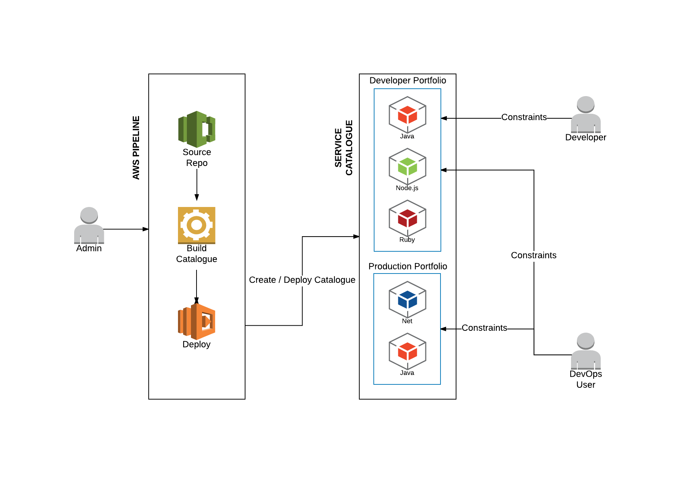

# AWS Cloud Platform

This is a cloud infrastructure build on top of AWS services. To be able to deploy this you need an AWS account.
You can use the AWS User Interface to deploy the code as well as the [CLI](https://aws.amazon.com/cli/).
Check their documentation how to configure your AWS [CLI](https://aws.amazon.com/cli/).

This repo contains a simple _todo application_ written in NodeJS and all the AWS configurations.

## How to run

The repo have a working demo that  creates several AWS resources, creates a CD (Continuous Deployment) pipeline and
Instances where the code will run. The demo uses the NodeJS code present on this repo to show the workflow.

### Prerequisites

There are 8 regions supporting all the resources required to create the stack:

 * Virginia: **us-east-1**
 * Ohio: **us-east-2**
 * California: **us-west-1**
 * Oregon: **us-west-2**
 * Ireland: **eu-west-1**
 * Frankfurt: **eu-central-1**
 * Sydney: **ap-southeast-2**
 * Tokyo: **ap-northeast-1**

You need also to have an AWS account and configure the [AWS CLI](https://aws.amazon.com/cli/):

 * AWS IAM user within product development account
 * AWS CLI installed
 * AWS credentials configured

If you intend to use git to push some code to codecommit, please follow the instructions on this page:
http://docs.aws.amazon.com/codecommit/latest/userguide/setting-up-ssh-unixes.html?icmpid=docs_acc_console_connect

### Parameters Conditions Explained

 * Use DNS -> This option when enabled will map the Elastic Load Balancer to a subdomain in al-labs.co.uk
 * Use HTTPS -> This option when enabled will create a certificate using the Amazon Certificate Manager and attach it to the Elastic Load Balancer to create a secure HTTPS connection.
 * Use ElasticsearchLogs -> This option when enabled will stream logs to an Elastic Search instance.
 * Use Spot Instances -> This option when enabled will use Spot Instances instead of On-Demand Instances.
   Spot Instances cost far less than On-Demand Instances and can be used in non-critical environments like development.
   AWS will provide a 2 minute warning and then terminate the instance.
   It is possible to fail-over to using On-Demand Instances when this happens, but this feature has not been implemented in this platform yet.
   - **WARNING: Spot Instances can be auto terminated by AWS when the Spot Price rises above your bid price.**
   - **WARNING: Spot Instances currently (June 2017) does not work in regions: Frankfurt, Singapore, Sydney, Tokyo.**
   - **UPDATE (28th July 2017):  Spot Instances work in all regions where this stack can deploy to.**
   - $0.02 can be the minimum set to all regions. The template has $0.05 has the default price. 
   - All (working) regions, except Ohio, support m3.medium as the smallest acceptable spot instance type. Ohio requires m4.large.

### Service Catalogue



An administrator or template author can add stacks to the product portfolio by committing them to the source control repository where they are then automatically built and deployed to the service catalogue.

Developers and administrators are then able to select products to build from the service catalogue.  Roles and privileges can be used to constrain users to specific products, and to specific parameters when building products, such as resource limits and access to data.

### Description of files

```
.
├── LICENSE.txt
├── README.md
├── mastertemplate.yaml
├── portfolio
│   ├── central-logging
│   │   └── central-logging-elasticsearch.yaml
│   ├── cloudplatform
│   │   └── ubuntu
│   │       └── node-sql
│   │           ├── app
│   │           │   ├── appspec.yml
│   │           │   └── containerapp.template.yaml
│   │           └── cloudplatform.yaml
│   └── mappings.yaml
└── servicecatalogue
    └── lambda
        ├── lambda-cloudformation.yaml
        ├── requirements.txt
        └── sync-catalog.py
```

### mastertemplate.yaml
Template for _CodePipeline_ to manage a _Service Catalog_. The pipeline consists of a _CodeCommit_ repository and the steps to manage the portfolio and its products.

### portfolio/
#### mappings.yaml
Instructions for the _CodePipeline_ defining the _Service Catalog_ portfolio and a list of products that are a part of it.

#### central-logging/
##### central-logging-elasticsearch.yaml
A central-logging Elasticsearch cluster that exports an endpoint so infrastructure and application stacks can stream data to it.

#### cloudplatform/ubuntu/note-sql/
##### cloudplatform.yaml
Main _CloudFormation_ template for infrastructure deployment.
##### containerapp.template.yaml
Used by the _CodePipeline_ defined in cloudplatform.yaml to deploy an alternative container backend for the application.

### servicecatalogue/lambda
#### lambda-cloudformation.yaml
_CloudFormaiton_ template to deploy a stack with the lambda code from this directory and its supporting resources.
#### requirements.txt
Python dependencies to be packaged with lambda code.
#### sync-catalog.py
Code of the lambda used to manage the _Service Catalog_ portfolio.

### Launch the stack

 * Use AWS console to
[](https://console.aws.amazon.com/cloudformation/home#/stacks/new?region=eu-west-1&stackName=al-example&templateURL=https://s3.amazonaws.com/al-cf-templates-us-east-1/templates/cloudplatform.yaml)
.

 * You can also use a *deploy* script from *utils/* folder to create the stack.

```
STACK_NAME=<stack name> REGION=<region> ./utils/deploy.sh
```

#### Manual creation

*Note*: you need to specify your key name on parameters _KeyName_!

```
aws cloudformation deploy --region "eu-west-1" --template-file "cloudformation/cloudplatform.yaml" --stack-name "test-stack" --capabilities "CAPABILITY_NAMED_IAM" --parameter-overrides KeyName="mykey"
```

##### Deploy the code to code commit (It will trigger the code pipeline)

First you need to get your git repo URL (from CodeCommit) to push your code. You can go to AWS CodeCommit UI or use the AWS CLI:

```
GIT_REMOTE=$(aws cloudformation describe-stacks --region "eu-west-1" --stack-name "test-stack"  --query "Stacks[].Outputs[?OutputKey=='RepoURL'].OutputValue"  --output text)
```

Then add a new remote repository to your git and push the code

```
git remote add codecommit ${GIT_REMOTE}
git push codecommit master
```

### Cleanup

You can use a *cleanup* script from *utils/* folder to cleanup the resources created by a stack.

```
PREFIX=<resource prefix> REGION=<region> ./utils/cleanup.sh
```

#### Manual delete
To delete all the resources by hand from the demo you should execute this steps sequentially:

 1. Delete the [stack name]-Service stack. [AWS console](https://eu-west-1.console.aws.amazon.com/cloudformation/home?region=eu-west-1)
```
aws s3 rb --region "eu-west-1" s3://<stack name>-codepipeline-artifacts --force
```
 2. Delete the S3 bucket `<stack name>-codepipeline-artifacts`. [AWS console](https://console.aws.amazon.com/s3/home?region=eu-west-1)
```
aws ecr delete-repository --region "eu-west-1" --repository-name "<stack name>-myapp" --force
```
 3. Delete ECS Registry `<stack name>-myapp`. [AWS console](https://eu-west-1.console.aws.amazon.com/ecs/home?region=eu-west-1#/repositories)
```
aws cloudformation wait stack-delete-complete --region "eu-west-1" --stack-name "<stack name>-MyApp-Service"
```
 4. Delete the `<stack name>`. [AWS console](https://eu-west-1.console.aws.amazon.com/cloudformation/home?region=eu-west-1)
```
aws cloudformation delete-stack --region "eu-west-1" --stack-name <stack name>
```
 5. Delete the ACM Certificates. [AWS console](https://eu-west-1.console.aws.amazon.com/acm/home?region=eu-west-1)
```
aws acm delete-certificate --region "eu-west-1" --certificate-arn <certificate ARN>
```
 6. Delete the Log Groups from CloudWatch. [AWS console](https://eu-west-1.console.aws.amazon.com/cloudwatch/home?region=eu-west-1#logs:)
```
aws logs delete-log-group --region "eu-west-1" --log-group-name <group name>
```

## Contributing

This repo has an **.editorconfig** file so you should install EditorConfig in your code editor/IDE to maintain code style consistency.

* VS Code - https://marketplace.visualstudio.com/items?itemName=EditorConfig.EditorConfig
* Atom - https://atom.io/packages/editorconfig

You can configure locally git hooks to run the tests before commit/push and then fail the pipeline

* You need to configure your repo to use the **.githooks** folder
```
git config core.hooksPath .githooks
```
